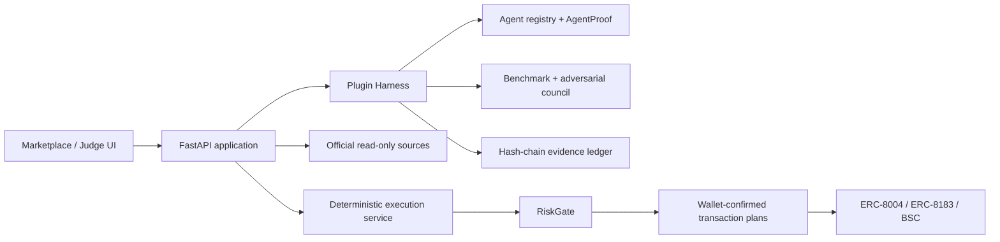

# SafeHire / ProofOps for BNB Chain

> **Hire proof-carrying BNB Chain DeFi agents with bounded permissions and
> verifiable settlement.**

SafeHire is a BNB Chain Agent marketplace and execution firewall. It does not treat
an ERC-8004 identity, an endpoint health score or an Agent's own marketing as proof
of performance. Users inspect job-specific evidence, review live commercial terms,
cap targets/methods/value/expiry, hire through ERC-8183, and keep a public delivery
and settlement trail.

```text
Discover → Compare proof → Quote → Limit authority → Hire
→ Delivery → Settle/refund → Receipt → Reputation
```

## Judge in 90 seconds

Latest real in-product purchase: **BSC mainnet Job #56743, 0.50 U, delivered and verified; settlement pending.**
[Watch the demo and inspect the evidence](https://safehire.eyesonchain.xyz/assets/submission-2026-09-08/index.html).
The project owner reported “我感觉值” (worth the price); this is AI-transcribed owner feedback, not independent review.

1. [**Marketplace — discover four live ERC-8004 categories**](https://safehire.eyesonchain.xyz)
2. [**Decision desk — compare job-specific evidence**](https://safehire.eyesonchain.xyz/decision)
3. [**Live quote and external ERC-8183 hire path**](https://safehire.eyesonchain.xyz/hire-live)
4. [**Delivery and on-chain proof dossier**](https://safehire.eyesonchain.xyz/proof)
5. [**Live judge scorecard**](https://safehire.eyesonchain.xyz/judge-scorecard)
6. [**TermiX benchmark lab**](https://safehire.eyesonchain.xyz/benchmark)

The scorecard is a deterministic evidence map, **not an official BNB Chain score**.
The event publishes Functionality, Data Quality and Agent Diversity as main-track
criteria but does not publish a numeric weighting.

## Why this is different

### Proof-carrying Agent marketplace

Every meaningful action can carry a linked evidence envelope:

- ERC-8004 identity and ownership;
- category-specific capability and required input;
- source freshness and live endpoint state;
- commercial quote and exact deliverables;
- scoped target/method/value/expiry permission;
- ERC-8183 job and funding receipts;
- provider output;
- settle/refund receipt;
- independent feedback and track record.

Identity is not silently promoted to performance. Sponsored output is not labelled
paid. A quote is not labelled a trade. Testnet evidence is not labelled mainnet.

### Bounded authority

The LLM is advisory. Deterministic controls remain authoritative:

- target and method allowlists;
- single-action and daily caps;
- slippage and expiry;
- idempotency;
- separate wallet session, policy and human approval;
- revoke and kill switch;
- no backend custody of the user's wallet.

## Official-rubric status

| Criterion | Current state | Reviewable evidence | Remaining proof |
|---|---|---|---|
| Functionality | Conditional | live discovery/quote, `/hire-live`, full BSC Testnet Job #808 | broader user validation and final mainnet settlement (Job #56743 delivered; owner value feedback recorded) |
| Data Quality | Conditional | current A2A probe, 8004scan signals, source/time labels, raw hashes | independent blind review and paid outcomes |
| Agent Diversity | Conditional | all four category routes; execution depth remains conditional | equally useful four-category service depth; second independent same-task supplier is an enhancement |
| TermiX | Provenance review required | three recorded pairs, original outputs and timings preserved | verify no-AI provenance, independent review and full workflow timing |
| PancakeSwap | Conditional | same-block multi-size quote and gas-aware benefit evidence | controlled real-use receipt would strengthen it |
| Altana | Not claimed | permission architecture alone is not eligibility | live session-key transaction and in-product revoke |

`Conditional` means the code path exists and is inspectable, while the strongest
adoption/quality claim still requires a real-world action. It is not replaced with
a fabricated green status.

## Current live and on-chain evidence

- [Service workspace](https://safehire.eyesonchain.xyz/workspace): private durable orders, four read-only monitoring categories, in-app alerts, recovery and explicit user feedback. Includes fresh supplier quote probes and four-category action preparation with bounded unsigned drafts and read-only simulation. No automatic trading. Opt-in Bark phone notifications require a device verification code; provider acceptance is not proof of human receipt. See the [security model](docs/06_SECURITY_AND_THREAT_MODEL.md).
- ChainHelix #269224 delivered paid mainnet Job #56741 (0.5 U). Signed task, raw manifest and grid arithmetic were recomputed by SafeHire on GreenCloud. This was purchased on the supplier site; it is submitted delivery, not final settlement or a newly measured SafeHire purchase.

- Four categories are listed, but live service depth is uneven. ChainHelix grid, lending-health and yield-allocation calculators have verified sample quotes at 0.50 U each. They share one operator and do not execute trades. The two new calculators still need first paid deliveries. LP paid supply remains unresolved.
- Quote availability and fees depend on the supplier. New quotes for supplier #265375 are paused after funded Job #56733 produced no delivery; the hardened buyer verifies request/response hashes, chain and Commerce binding, quote expiry, and the provider's EIP-191 or ERC-1271 signature.
- `/hire-live` anchors the exact signed JobDescription, calculates expiry from provider ETA plus the on-chain dispute window, restores an interrupted job from BSC state, verifies the retrieved delivery manifest against its on-chain hash, and exposes explicit dispute/settle/refund branches.
- BSC Testnet Job #808 has successful create, register, budget, approve, fund,
  delivery and settlement receipts plus observed provider payment.
- `AgentRegistry`, `ScopedExecutionPolicy` and `EvidenceAnchor` are deployed on
  BSC Testnet with transaction evidence.
- SafeHire Agent #2032 has ERC-8004 owner, wallet and URI read-back evidence.
- The PancakeSwap report compares `0.01 / 0.1 / 1 WBNB` at one observed block and
  exposes the gas-estimation boundary.
- TermiX retains complete Agent/no-Agent outputs, time, cost, quality baseline and
  SHA-256 fingerprints.
- The evidence ledger is append-only and hash chained.

Primary evidence:

- `evidence/marketplace/live-agent-catalog.json`
- `evidence/sponsor-integration/erc8004-registration.json`
- `evidence/sponsor-integration/erc8183-job-808.json`
- `evidence/pancakeswap/live-benefit-report.json`
- [Human comparison report](https://safehire.eyesonchain.xyz/api/evidence/termix/human-study) — three recorded pairs; names removed, answers unchanged. No-AI provenance needs review; no independent scores or verified efficiency multiplier.
- `evidence/termix/agent-advantage-report.json` — archived automated baseline.
- `deployments/bsc-testnet.json`

## Manual gates that code cannot complete honestly

1. Expand beyond owner validation: Job #56743 now proves an in-product paid purchase and verified calculation delivery, with owner value feedback. Final mainnet settlement and independent user quality validation remain pending.
2. Resolve the no-AI provenance hold on the three recorded comparisons; independent review remains unavailable.
3. Obtain a second independently operated, compatible same-task signed offer and useful paid delivery; separate operator identities alone are insufficient.
4. Use non-sleeping hosting during judging and publish a 2–3 minute single-path demo.
5. The owner must verify identity, prize wallet, contact fields and terms before
   submitting.

See the [in-product delivery record](docs/IN_PRODUCT_DELIVERY_AND_SUBMISSION_2026-09-08.zh-CN.md) for the verified purchase, delivery and notification boundaries.

## Architecture



The default deployment is a modular monolith. Signing and fund execution stay
isolated; adding microservices is intentionally deferred until real usage requires it.

## Local run

Python 3.11+:

```bash
cp .env.example .env
python -m venv .venv
source .venv/bin/activate
pip install -e '.[dev,bnb]'
python scripts/seed_demo.py
uvicorn apps.api.main:app --reload --port 8000
```

Open:

- marketplace: `http://localhost:8000`
- judge scorecard: `http://localhost:8000/judge-scorecard`
- OpenAPI: `http://localhost:8000/docs`

## Verification

```bash
python -m pytest -q
ruff check src apps tests scripts
mypy src apps scripts
python scripts/static_security_check.py
python scripts/submission_gate.py --allow-incomplete
python scripts/judge_scorecard.py --output judge-scorecard.json

cd contracts
npm ci --ignore-scripts
npm run compile
npm test
npm audit --omit=dev

cd ../agent-studio/safehireagents
corepack pnpm install --frozen-lockfile
corepack pnpm --dir app/agent build
```

Release package:

```bash
python scripts/build_release.py
```

The packager regenerates `ARTIFACT_MANIFEST.json` and excludes secrets, wallet
keystores, virtual environments, caches, build output and dependencies.

## Repository reading order

1. [Architecture](docs/02_ARCHITECTURE.md) and [domain model](docs/03_DOMAIN_AND_MODULE_DESIGN.md).
2. [Plugin interfaces](docs/04_PLUGIN_DECOUPLING.md).
3. [Security and threat model](docs/06_SECURITY_AND_THREAT_MODEL.md).
4. [Operations](docs/09_OPERATIONS.md).
5. [Evidence](evidence/README.md) and [submission record](submission/README.md).

## Security boundary

Self-operated execution adapters remain mainnet-disabled by default. The external
`/hire-live` path is a separate, explicit opt-in flow; every transaction is shown to
the wallet, and the maximum service price currently exposed by the reviewed catalog
is `0.50 U` for the wallet-pinned ChainHelix adapter; legacy reviewed orders remain `0.10 U`, plus BNB gas. Contracts and integrations have not received a third-party
audit. Use only a disposable, low-value contest wallet.
