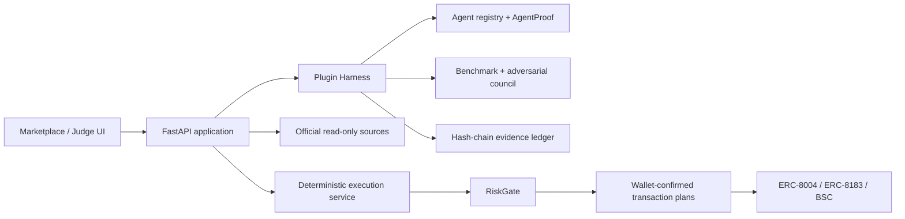

# SafeHire / ProofOps for BNB Chain

> **Hire proof-carrying BNB Chain DeFi agents with bounded permissions and
> verifiable settlement.**

SafeHire is a BNB Chain Agent marketplace and execution firewall. It does not treat
an ERC-8004 identity, an endpoint health score or an Agent's own marketing as proof
of performance. Users inspect job-specific evidence, review live commercial terms,
cap targets/methods/value/expiry, hire through ERC-8183, and keep a public delivery
and settlement trail.

```text
Discover → Compare proof → Quote → Limit authority → Hire
→ Delivery → Settle/refund → Receipt → Reputation
```

## Judge in 90 seconds

1. **Live judge scorecard**
   https://safehire-proofops-bnb.onrender.com/assets/judge-scorecard.html
2. **Marketplace — four live ERC-8004 categories**
   https://safehire-proofops-bnb.onrender.com
3. **External ERC-8183 hire path**
   https://safehire-proofops-bnb.onrender.com/hire-live
4. **On-chain proof dossier**
   https://safehire-proofops-bnb.onrender.com/proof
5. **TermiX benchmark lab**
   https://safehire-proofops-bnb.onrender.com/benchmark
6. **Public A2A Agent Card**
   https://safehire-proofops-bnb.onrender.com/.well-known/agent-card.json

The scorecard is a deterministic evidence map, **not an official BNB Chain score**.
The event publishes Functionality, Data Quality and Agent Diversity as main-track
criteria but does not publish a numeric weighting.

## Why this is different

### Proof-carrying Agent marketplace

Every meaningful action can carry a linked evidence envelope:

- ERC-8004 identity and ownership;
- category-specific capability and required input;
- source freshness and live endpoint state;
- commercial quote and exact deliverables;
- scoped target/method/value/expiry permission;
- ERC-8183 job and funding receipts;
- provider output;
- settle/refund receipt;
- independent feedback and track record.

Identity is not silently promoted to performance. Sponsored output is not labelled
paid. A quote is not labelled a trade. Testnet evidence is not labelled mainnet.

### Bounded authority

The LLM is advisory. Deterministic controls remain authoritative:

- target and method allowlists;
- single-action and daily caps;
- slippage and expiry;
- idempotency;
- separate wallet session, policy and human approval;
- revoke and kill switch;
- no backend custody of the user's wallet.

## Official-rubric status

| Criterion | Current state | Reviewable evidence | Remaining proof |
|---|---|---|---|
| Functionality | Conditional | live discovery/quote, `/hire-live`, full BSC Testnet Job #808 | first paid external mainnet delivery |
| Data Quality | Conditional | current A2A probe, 8004scan signals, source/time labels, raw hashes | independent blind review and paid outcomes |
| Agent Diversity | Conditional | all four required categories with equal activation depth | second independent provider |
| TermiX | Conditional | three raw Agent/no-Agent pairs and reproducible baseline | human timing and independent blind review |
| PancakeSwap | Conditional | same-block multi-size quote and gas-aware benefit evidence | controlled real-use receipt would strengthen it |
| Altana | Not claimed | permission architecture alone is not eligibility | live session-key transaction and in-product revoke |

`Conditional` means the code path exists and is inspectable, while the strongest
adoption/quality claim still requires a real-world action. It is not replaced with
a fabricated green status.

## Current live and on-chain evidence

- Four external BSC mainnet ERC-8004 skills cover rebalancing, grid trading,
  yield optimisation and health-factor monitoring.
- Each card can request a live `0.10 U` quote without connecting a wallet.
- `/hire-live` continues a reviewed quote into wallet-confirmed ERC-8183
  create/register/budget/approve/fund/delivery/settle-or-refund steps.
- BSC Testnet Job #808 has successful create, register, budget, approve, fund,
  delivery and settlement receipts plus observed provider payment.
- `AgentRegistry`, `ScopedExecutionPolicy` and `EvidenceAnchor` are deployed on
  BSC Testnet with transaction evidence.
- SafeHire Agent #2032 has ERC-8004 owner, wallet and URI read-back evidence.
- The PancakeSwap report compares `0.01 / 0.1 / 1 WBNB` at one observed block and
  exposes the gas-estimation boundary.
- TermiX retains complete Agent/no-Agent outputs, time, cost, quality baseline and
  SHA-256 fingerprints.
- The evidence ledger is append-only and hash chained.

Primary evidence:

- `evidence/marketplace/live-agent-catalog.json`
- `evidence/sponsor-integration/erc8004-registration.json`
- `evidence/sponsor-integration/erc8183-job-808.json`
- `evidence/pancakeswap/live-benefit-report.json`
- `evidence/termix/agent-advantage-report.json`
- `deployments/bsc-testnet.json`

## Manual gates that code cannot complete honestly

1. Execute and capture one bounded external mainnet `0.10 U` paid delivery.
2. Complete at least three human no-Agent runs and independent blind A/B reviews.
3. Onboard a second independent ERC-8004 provider.
4. Use non-sleeping hosting during judging and publish a 2–3 minute single-path demo.
5. The owner must verify identity, prize wallet, contact fields and terms before
   submitting.

See `docs/MANUAL_COMPLETION_GATES_2026-08-31.md`.

## Architecture



The default deployment is a modular monolith. Signing and fund execution stay
isolated; adding microservices is intentionally deferred until real usage requires it.

## Local run

Python 3.11+:

```bash
cp .env.example .env
python -m venv .venv
source .venv/bin/activate
pip install -e '.[dev,bnb]'
python scripts/seed_demo.py
uvicorn apps.api.main:app --reload --port 8000
```

Open:

- marketplace: `http://localhost:8000`
- judge scorecard: `http://localhost:8000/assets/judge-scorecard.html`
- OpenAPI: `http://localhost:8000/docs`

## Verification

```bash
python -m pytest -q
ruff check src apps tests scripts
mypy src apps scripts
python scripts/static_security_check.py
python scripts/submission_gate.py --allow-incomplete
python scripts/judge_scorecard.py --output judge-scorecard.json

cd contracts
npm ci --ignore-scripts
npm run compile
npm test
npm audit --omit=dev

cd ../agent-studio/safehireagents
corepack pnpm install --frozen-lockfile
corepack pnpm --dir app/agent build
```

Release package:

```bash
python scripts/build_release.py
```

The packager regenerates `ARTIFACT_MANIFEST.json` and excludes secrets, wallet
keystores, virtual environments, caches, build output and dependencies.

## Repository reading order

1. [`AGENTS.md`](AGENTS.md) — hard safety, evidence and scope invariants.
2. [`agent.md`](agent.md) — task-oriented file index.
3. [`docs/11_JUDGE_WINNING_STRATEGY_2026-08-31.md`](docs/11_JUDGE_WINNING_STRATEGY_2026-08-31.md)
   — current official-rubric strategy and demo.
4. [`docs/12_ADVERSARIAL_CONSENSUS_2026-08-31.md`](docs/12_ADVERSARIAL_CONSENSUS_2026-08-31.md)
   — ten-role debate and consensus.
5. [`docs/PAST_WINNERS_AND_JUDGE_PATTERNS_2026-08-31.md`](docs/PAST_WINNERS_AND_JUDGE_PATTERNS_2026-08-31.md)
   — official winner patterns and current gap analysis.
6. `docs/02_ARCHITECTURE.md` through `docs/10_EXTERNAL_COMPLETION_CHECKLIST.md`
   — implementation, security, operation and submission details.

## Security boundary

Self-operated execution adapters remain mainnet-disabled by default. The external
`/hire-live` path is a separate, explicit opt-in flow; every transaction is shown to
the wallet, and the maximum service price currently exposed by the reviewed catalog
is `0.10 U` plus BNB gas. Contracts and integrations have not received a third-party
audit. Use only a disposable, low-value contest wallet.
