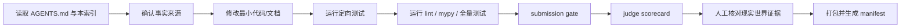

# SafeHire / ProofOps 工作索引

这是面向开发 Agent、评审者和项目维护者的入口索引。安全与证据硬约束以
[`AGENTS.md`](AGENTS.md) 为准；本文件回答“当前应该读什么、改什么、如何验证”。

## 一句话定位

**SafeHire 是 BNB Chain 上的 Proof-carrying Agent Marketplace：每一次发现、比较、
授权、雇佣、交付和结算，都携带可复核证据与明确权限边界。**

这句话必须贯穿首页、演示、提交材料与代码。不要把项目讲成：

- 普通 DeFi 聊天机器人；
- 四个互不相关的 Agent demo；
- 只展示 ERC-8004 卡片的目录；
- 仅靠“安全”口号的权限面板；
- 通过自评分证明自己更好的 benchmark。

## 评委最快阅读路径

| 顺序 | 入口 | 评委应看到什么 |
|---:|---|---|
| 1 | `/assets/judge-scorecard.html` | 官方三项主评分逐项状态、四类同深度、人工门槛 |
| 2 | `/` | 四类真实 ERC-8004 Agent、实时可调用性、索引信号与诚实边界 |
| 3 | `/hire-live` | 报价 → ERC-8183 任务 → 精确授权 → 托管 → 交付 → 结算/退款 |
| 4 | `/proof` | Job #808、ERC-8004、三份合约、PancakeSwap 和 TermiX 原始证据 |
| 5 | `/benchmark` | 真人计时、隐藏 A/B、独立盲评与秘密映射 |
| 6 | GitHub | 测试、CI、安全门禁、文档与可复现脚本 |

## 当前判定

| 评分面 | 当前状态 | 已有证明 | 仍缺什么 |
|---|---|---|---|
| Functionality | Conditional | 真实发现/报价、`/hire-live`、Job #808 完整测试网结算 | 第一笔外部主网付费交付 |
| Data Quality | Conditional | 实时 A2A、8004scan 信号、来源/时间、原始输出 hash | 独立盲评、付费结果历史 |
| Agent Diversity | Conditional | 四个官方类别均有专属 skill 与同一证据包络 | 第二个独立运营方 |
| TermiX | Conditional | 三组 live raw pairs 与自动规则基线 | 三组真人计时与独立盲评 |
| PancakeSwap | Conditional | 同区块多档报价、Gas 估算、可重算净改善 | 一次受控真实使用证据更强 |
| Altana | Not claimed | 权限理念相符，但不是资格证据 | 真实 session-key 交易与撤销 |

`Conditional` 不是“不能提交”，而是“代码路径成立，但获奖级主张还需要现实世界证据”。

## 文档索引

### 第一优先级：当前冲奖决策

1. [`docs/11_JUDGE_WINNING_STRATEGY_2026-08-31.md`](docs/11_JUDGE_WINNING_STRATEGY_2026-08-31.md)  
   官方规则、历届获奖模式、创新点、评委叙事、冲刺顺序。
2. [`docs/12_ADVERSARIAL_CONSENSUS_2026-08-31.md`](docs/12_ADVERSARIAL_CONSENSUS_2026-08-31.md)  
   十个评审角色的攻击、冲突与共识。
3. [`docs/PAST_WINNERS_AND_JUDGE_PATTERNS_2026-08-31.md`](docs/PAST_WINNERS_AND_JUDGE_PATTERNS_2026-08-31.md)  
   官方获奖作品中反复出现的评审偏好，并已同步当前代码状态。
4. [`docs/MANUAL_COMPLETION_GATES_2026-08-31.md`](docs/MANUAL_COMPLETION_GATES_2026-08-31.md)  
   不能由代码自动完成的链上付款、真人评审、供应方和提交动作。
5. [`docs/HACKATHON_FINAL_SUBMISSION_CHECKLIST_2026-08-31.md`](docs/HACKATHON_FINAL_SUBMISSION_CHECKLIST_2026-08-31.md)  
   表单和最终运营检查。涉及“当前是否已有某功能”时，以前四份文档为准。

### 第二优先级：实现设计

| 文档 | 用途 |
|---|---|
| `docs/00_OFFICIAL_IMPLEMENTATION_REFERENCES.md` | 官方 SDK、标准、协议和地址来源 |
| `docs/01_COMPETITION_REQUIREMENTS.md` | 赛题与验收映射 |
| `docs/02_ARCHITECTURE.md` | 模块化单体、隔离执行和数据流 |
| `docs/03_DOMAIN_AND_MODULE_DESIGN.md` | 领域模型与模块契约 |
| `docs/04_PLUGIN_DECOUPLING.md` | Harness 插件生命周期与依赖 |
| `docs/05_MULTI_AGENT_ADVERSARIAL_REVIEW.md` | 十角色确定性评审协议 |
| `docs/06_SECURITY_AND_THREAT_MODEL.md` | 资金、签名、重放、越权和证据威胁 |
| `docs/07_CONSTRUCTION_BLUEPRINT.md` | 施工顺序 |
| `docs/08_DEMO_AND_SUBMISSION.md` | 演示与提交叙事 |
| `docs/09_OPERATIONS.md` | 生产和评审期运行 |
| `docs/10_EXTERNAL_COMPLETION_CHECKLIST.md` | 外部依赖与人工动作 |

## 代码索引

### 市场与实时数据

- `src/proofops/services/live_agent_market.py`  
  已审核目录 + 当前 A2A 探测 + 8004scan 信号；不把索引健康分冒充交付质量。
- `src/proofops/integrations/`  
  BSC RPC、8004scan、Venus、Lista、PancakeSwap 官方数据适配。
- `evidence/marketplace/live-agent-catalog.json`  
  四类外部 Agent 的可复核快照。

### 雇佣与权限

- `src/proofops/services/live_erc8183.py`  
  外部主网 ERC-8183 交易计划、状态、通知、结算与退款。
- `src/proofops/execution/`  
  policy、task、RiskGate、幂等、存储与执行适配。
- `contracts/src/ScopedExecutionPolicy.sol`  
  链上范围、额度、方法、期限和授权边界。
- `apps/web/live-hire.html` 与相关 assets  
  每笔钱包动作显式确认的主网雇佣页。

### 证据与评分

- `src/proofops/services/submission.py`  
  是否具备提交级结构的 fail-closed 门禁。
- `src/proofops/judging/scorecard.py`  
  按 Functionality / Data Quality / Agent Diversity 分开输出，不伪造官方权重。
- `scripts/judge_scorecard.py`  
  生成机器可读的 `judge-scorecard.json`。
- `src/proofops/plugins/adversarial.py`  
  十角色对抗评审；安全和证据 veto 不能被语言模型覆盖。
- `src/proofops/plugins/evidence.py`  
  append-only hash-chain 账本。
- `apps/web/assets/judge-scorecard.html`  
  评委实时自检页，接口失败时 fail closed。

### Agent 与协议

- `src/proofops/agents/` — 四类本地确定性预演 Agent。
- `agent-studio/safehireagents/` — 官方 Agent Studio seller；进入此目录先读其 `AGENTS.md`。
- `contracts/src/AgentRegistry.sol` — 本地/测试网身份登记。
- `contracts/src/EvidenceAnchor.sol` — 证据锚定。
- `evidence/sponsor-integration/erc8183-job-808.json` — 已完成测试网雇佣闭环。
- `evidence/sponsor-integration/erc8004-registration.json` — SafeHire 自有 Agent 身份。

## 修改流程



### 修改 contest claim 时

1. 先找到支撑它的 JSON、交易、API 或官方页面。
2. 写清 `live / testnet / sponsored / demo`。
3. 同步 README、策略文档、scorecard 和 submission metadata。
4. 不存在现实证据时，改成“manual required”，不要改成“ready”。

### 修改资金路径时

1. 先写失败路径和权限边界；
2. 再改交易计划；
3. 再补单元测试、重放/过期/金额/网络测试；
4. 最后才改 UI；
5. 绝不自动替用户签名、批准或付款。

## 本地与 CI 命令

```bash
python -m pytest -q
ruff check src apps tests scripts
mypy src apps scripts
python scripts/static_security_check.py
python scripts/submission_gate.py --allow-incomplete
python scripts/judge_scorecard.py --output judge-scorecard.json
make contracts
make agent-studio
python scripts/build_release.py
```

## 冲刺优先级

只按这个顺序投入比赛前时间：

1. 外部 0.10 U 付费交付；
2. 三项真人计时 + 独立盲评；
3. 第二运营方；
4. 稳定托管与 2–3 分钟视频；
5. 刷新 live catalog、无痕窗口验收、表单提交。

不要用第五个功能替代第一条真实证据。
