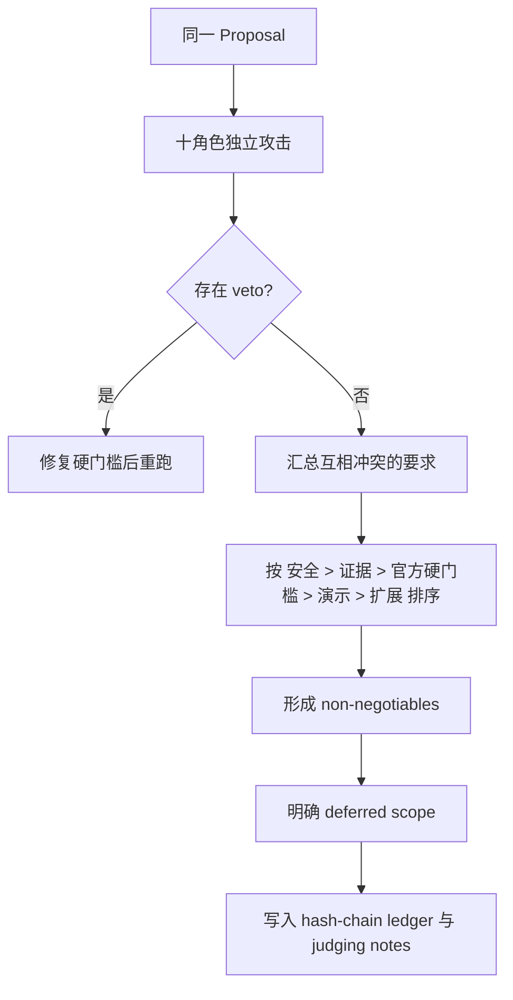

# 多角色对抗评审协议

## 为什么不是“让几个 Agent 都说好”

SafeHire 的多 Agent 机制是一个可复现的评审委员会，不是多个聊天窗口共同写营销文案。
每个角色拥有不同利益函数；安全、证据和官方硬门槛可以 veto，语言模型不能删除 veto。

实现：`src/proofops/plugins/adversarial.py`  
测试：`tests/test_lp_benchmark_debate.py`  
当前决议：`evidence/judging-notes/adversarial-decision.json`

## 十个角色

| 角色 | 首要问题 | 可以 veto 的情况 |
|---|---|---|
| BNB Main Judge | 能否从发现走到激活/结算，没有死路 | 无 live BSC 计划或无 live hire path |
| BNB Data Quality Judge | 数据是否实时、可追源、能支持选择 | 缺少大部分核心决策信号 |
| BNB Diversity Judge | 四类是否同等深度，而非四张标签 | 缺任一官方类别 |
| TermiX Sponsor Judge | 三个真实任务是否能证明 Agent 优势 | 没有三任务对照计划 |
| Pancake DeFi Reviewer | 是否给交易者或 LP 可重算的真实好处 | 不作为主赛 veto，但会降级伙伴奖 |
| Altana Session Reviewer | 是否真的有 scoped session tx 和 revoke | 不影响主赛；阻止虚假 Altana claim |
| Security Red Team | 是否可越权、重放、无限授权、绕过人工确认 | 缺任一核心资金安全控制 |
| System Architect | 是否为了比赛过度微服务化或耦合签名 | 架构风险进入强制整改 |
| Solo Builder Schedule Attacker | 剩余工作是否能由独立开发者完成 | 迫使砍掉低价值范围 |
| Evidence Auditor | 交易、来源、raw output、fixture 是否可核验 | 缺关键证据或混淆 evidence mode |

## 输入模型

`Proposal` 除了产品、架构、安全和证据，还包含：

- `category_depth`：四个官方类别；
- `decision_data_signals`：freshness、identity、price、reputation、feedback、risk boundary；
- `live_hire_path`：真实发现是否接到 ERC-8183；
- `provider_count`：独立运营方数量；
- `paid_external_deliveries`：已核验外部付费交付数；
- `human_blind_reviews`：独立盲评数；
- `altana_live_session`：是否有真实 session-key 与撤销证据。

默认值忠实描述当前仓库，因此委员会会接受整体方案，同时保留现实缺口，而不是给出虚假的全绿结论。

## 两轮收敛协议

### 第一轮

角色不能先看别人的结论。每个角色输出：

- `score`
- `verdict`
- `strengths`
- `attacks`
- `required_changes`
- `veto`

### 第二轮

发生冲突时采用固定优先级：

1. 资产和密钥安全；
2. 证据真实性；
3. 官方资格与评分硬门槛；
4. 评委理解速度；
5. 工程扩展性；
6. 新功能数量。

因此：

- “为了演示更顺自动签名”必定输给安全；
- “为了分数把预演写成利润”必定输给证据；
- “再接一个 Sponsor logo”必定输给已存在主线的真实使用证明；
- “做多链看起来更大”必定输给四类同深度和比赛期可靠性。

## 当前共识

委员会一致同意：

1. 保留 **Proof-carrying Agent Marketplace** 作为唯一主叙事；
2. 保留四类同一证据包络，不再增加第五类；
3. 保留 `/hire-live`，把第一笔外部付费交付作为最高优先级；
4. TermiX 自动评分只能叫 reproducible baseline，必须用真人盲评升级；
5. PancakeSwap 只声称可重算的 quote/decision benefit，不声称已实现利润；
6. Altana 在没有 live session + revoke 前不申报；
7. 第二运营方比增加更多同一运营方卡片更有价值；
8. Judge Scorecard 逐项呈现官方 criterion，不计算“官方总分”；
9. 主网动作持续逐笔钱包确认；
10. 新链、聊天、预测模型和新合约全部延期。

完整争论和少数意见见
`docs/12_ADVERSARIAL_CONSENSUS_2026-08-31.md`。

## 回归约束

测试必须至少证明：

- 默认十角色方案可接受但仍暴露人工缺口；
- 缺类别会触发 `bnb_diversity_judge` veto；
- 缺安全控制会触发 `security_red_team` veto；
- 无 live BSC 路径会触发 `bnb_main_judge` veto；
- 只贴 Altana 名称而无 session 证据会被明确攻击；
- 角色数量使用 `len(CouncilRole)`，防止新增角色后测试悄悄过期。
