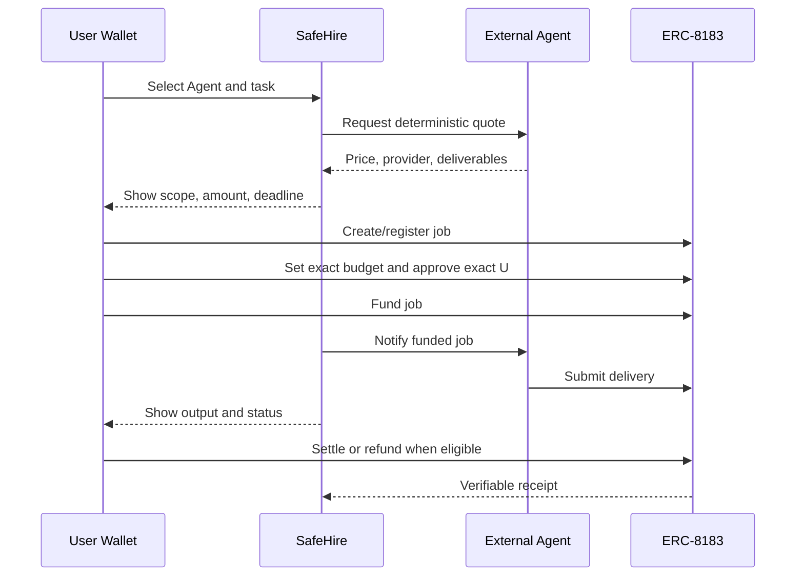

# SafeHire / ProofOps 冲奖策略与施工决策

> 日期：2026-08-31
> 目标：在不伪造事实、不扩大资产风险的前提下，提高 BNB Chain The Smart Money Era
> 主赛、TermiX 与 PancakeSwap 伙伴奖的综合竞争力。

## 执行摘要

SafeHire 不应再被包装成“四个 DeFi Agent 的集合”，而应统一为：

> **The proof-carrying marketplace for BNB Chain agents — compare verified work,
> cap authority, hire through ERC-8183, and settle against a reviewable delivery.**

中文：

> **BNB Chain 的可证明 Agent 雇佣与结算层：先比较真实工作证据，再限制权限，最后只对
> 可复核交付结算。**

当前代码已经有完整雏形。影响获奖率的最大变量不是功能数量，而是四件现实证据：

1. 第一笔外部主网付费交付；
2. 三项真人对照与独立盲评；
3. 第二个独立运营方；
4. 评审期稳定运行与一条 2–3 分钟演示。

## 官方评分映射

官方主赛公开列出 Functionality、Data Quality、Agent Diversity，但没有公布数字权重。
因此不做加权“官方预测分”，只做逐项判定。

| 评分项 | 评委真正要验证 | SafeHire 已实现 | 获奖级缺口 |
|---|---|---|---|
| Functionality | 找到、理解、激活，没有死路 | live discovery、quote、`/hire-live`、Job #808、settle/refund | 外部付费交付尚无历史记录 |
| Data Quality | 数据实时、准确、能支持选择 | A2A live probe、8004scan 信号、时间/来源、raw outputs | 独立质量评审和 paid outcome 稀少 |
| Agent Diversity | 四类同等深度 | 四类各有 skill、输入、身份、quote 和 hire route | 四类目前均来自同一运营方 |

### TermiX

官方将价值、可证明 Agent 优势、高风险/历史记录和市场质量作为评分面，并要求至少三个
Agent vs no-Agent 真实任务。

当前：

- raw input/output、耗时、成本、hash 和自动规则基线已存在；
- `/benchmark` 已支持不可暂停计时和隐藏 A/B；
- 仍缺真人运行与独立 reviewer。

因此 submission 可以展示结构，但不能把自动评分写成独立研究结论。

### PancakeSwap

当前同区块、多档金额、多个 fee tier 和 Gas 估算的报告，已经比单点静态 APY 卡片强。
提交时只声称：

- 路由选择或 LP 决策的可重算改善；
- 来源、区块与风险边界可核验；
- 实际交易前必须刷新 quote。

不声称真实利润，不把 Quoter gasEstimate 当最终 Router gas。

### Altana

权限模型在理念上契合，但当前没有完整 Altana session-key 交易与应用内 revoke 的公开证据。
策略是 **不申报、不贴 logo、不稀释主线**。只有现实证据全部完成后再重新评估。

## 历届获奖模式转化为产品原则

| 获奖模式 | 产品原则 | 本轮落地 |
|---|---|---|
| 真实输入到真实动作 | 不停在推荐 | live quote 接 ERC-8183 hire |
| 高级能力简单化 | 评委 90 秒理解 | 独立 Judge Scorecard + 单线 demo |
| 协议原生收益 | 结果可重算 | Pancake same-block benefit |
| 安全真正影响执行 | Risk control 在关键路径 | policy、caps、approval、revoke |
| 可复用/可扩展 | 不是硬编码展示页 | provider intake、plugin harness |
| 采用与交易指标 | 真实使用放大可信度 | 外部 paid delivery、第二 provider |

## 关键创新设计

### 1. AgentProof Envelope

每个 Agent/任务不再只有“星级评分”，而是一个分层证据包：

```text
Identity
  + Capability schema
  + Source freshness
  + Live commercial quote
  + Task-specific risk/benefit evidence
  + Scoped permission
  + Delivery artifact
  + Settlement/refund receipt
  + Independent feedback
```

规则：

- 身份只能证明“是谁”，不能证明“做得好”；
- endpoint health 只能证明“现在能访问”，不能证明“输出正确”；
- sponsored task 只能证明“路径能运行”，不能证明“有人付费”；
- paid outcome 才能进入 paid track record；
- 低证据等级必须给最终排序设上限。

### 2. Bounded Activation

Agent 市场最危险的不是推荐错一次，而是给了过大的持续权限。SafeHire 将激活拆成：



后端只生成并校验 calldata，不能代替用户钱包确认。

### 3. Judge-facing Proof Graph

评委不应该在十几份文档中自行拼接证据。新增 Judge Scorecard 把每个官方 criterion
映射到：

- 当前状态；
- 支撑事实；
- 失败/未完成项；
- 下一步入口；
- 诚实边界。

这不是自评分，而是证据导航层。

## 十角色对抗委员会结论

委员会角色：

1. BNB Main Judge
2. BNB Data Quality Judge
3. BNB Diversity Judge
4. TermiX Sponsor Judge
5. Pancake DeFi Reviewer
6. Altana Session Reviewer
7. Security Red Team
8. System Architect
9. Solo Builder Schedule Attacker
10. Evidence Auditor

默认提案得出 `accepted=true`，但不是“全绿”：

- 无 veto；
- 接受主叙事；
- 把外部 paid delivery、真人 blind review、第二 provider 定为强制现实证据；
- 把多链、第五类、通用聊天、新合约和 ML 预测全部延期；
- 禁止把 Judge Scorecard 叫官方得分。

完整过程见 `docs/12_ADVERSARIAL_CONSENSUS_2026-08-31.md`。

## 施工改动

### 代码

- `src/proofops/judging/scorecard.py`
  从当前 evidence 和 submission gate 生成机器可读评分映射。
- `scripts/judge_scorecard.py`
  CI/本地生成 `judge-scorecard.json`。
- `apps/web/assets/judge-scorecard.html|css|js`
  评委实时页面；接口失败时不使用陈旧 fallback。
- `src/proofops/plugins/adversarial.py`
  七角色升级为十角色；新增数据质量、四类深度、运营方/采用、Altana 证据门禁。
- `tests/test_judge_scorecard.py`
  验证四类同深度、无伪造官方分、现实缺口显式保留。
- `tests/test_lp_benchmark_debate.py`
  验证类别、安全、live path veto 和虚假 Sponsor claim。

### 文档与索引

- 根 `AGENTS.md`：安全、证据和 scope contract；
- 根 `agent.md`：任务型索引；
- 本文：冲奖总策略；
- `docs/12_ADVERSARIAL_CONSENSUS_2026-08-31.md`：完整争论；
- 更新历届获奖分析，删除“没有 live hire 页”的过时结论；
- README 改为 judge-first；
- submission metadata 增加 Judge Scorecard 入口。

### CI 与交付

- CI 额外生成 scorecard，确保自检器每次都能运行；
- `judge-ready-delivery` workflow 运行测试/门禁、构建 release ZIP、上传 manifest 与 scorecard；
- ZIP 继续由现有 `build_release.py` 排除 secret、wallet 和 build 路径。

## 评委演示脚本

### 0:00–0:20：问题与不同点

“Agent marketplaces tell you what an Agent claims. SafeHire shows what it has proven,
limits what it may do, and settles only after a reviewable delivery.”

打开 Judge Scorecard，只指出三个 criterion 和 conditional 原因，不念所有字段。

### 0:20–0:55：真实市场与选择数据

打开首页：

- 四类 live ERC-8004 Agent；
- 当前 A2A callable；
- official-index signal 与 SafeHire observation 分开；
- 点 quote，看 0.10 U、provider、deliverables 和 no-transaction boundary。

### 0:55–1:40：权限与雇佣

进入 `/hire-live`：

- 展示任务输入；
- 钱包、chain、exact amount；
- create/register/budget/approve/fund；
- 强调每步单独确认；
- 展示 delivery、settle/refund。

正式演示最好使用已完成的第一笔外部任务回执，避免现场真的等待 Agent。

### 1:40–2:10：证明

进入 `/proof`：

- ERC-8004 identity；
- Job #808 完整闭环；
- scoped policy contracts；
- Pancake measurable benefit；
- raw transaction links。

### 2:10–2:40：Agent advantage

进入 `/benchmark`：

- 相同输入，两条路径；
- raw outputs；
- human timer；
- random A/B；
- independent review；
- 不把当前自动基线冒充 blind review。

### 2:40–3:00：为何能成为官方市场

- provider intake；
- plugin architecture；
- 四类同一 evidence envelope；
- no custodial backend signing；
- one-line close：

“SafeHire turns BNB Agents from callable software into accountable services.”

## 剩余动作排序

### P0：完成后再录最终视频

1. 完成一笔外部 0.10 U mainnet hire；
2. 保存 provider output、所有 tx、最终 settlement；
3. 将该任务作为一项 TermiX Agent output；
4. 完成对应 no-Agent 真人计时；
5. 找另一位评审者盲评。

### P1：显著提高 canonical marketplace 说服力

6. 通过 provider intake 引入第二运营方；
7. 至少给一个类别两个不同 provider/risk/price 选择；
8. 把真实交付时延、成功状态、价格和反馈回写卡片；
9. 使用非休眠部署覆盖评审期。

### P2：包装

10. 录制 2–3 分钟单线视频；
11. 无痕窗口走完 Judge Scorecard → market → hire → proof → benchmark；
12. 刷新 48 小时内 live catalog；
13. 核对 submission one-liner、钱包和条款后提交。

## 明确不做

比赛前不做：

- 多链；
- 第五类 Agent；
- 通用聊天；
- 无人值守 mainnet 执行；
- 复杂预测模型；
- 新 token / 新经济模型；
- 只为 Sponsor logo 的半成品集成；
- 无法在演示中产生用户结果的新合约。

## 提交文案建议

### One-line pitch

> Hire proof-carrying BNB Chain DeFi agents with bounded permissions and
> verifiable settlement.

### 价值说明

> SafeHire is a BNB Chain marketplace where Agent identity is not confused with
> performance. Users compare task-level evidence, see live commercial terms, cap
> targets, methods, value and expiry, hire through ERC-8183, and settle or refund
> against a reviewable delivery. Four required DeFi Agent categories share the same
> evidence and activation depth. ERC-8004 identities, BSC receipts, raw Agent-vs-
> no-Agent outputs and PancakeSwap benefit calculations remain publicly inspectable.

### 创新说明

> The innovation is a proof-carrying service envelope for Agent commerce: identity,
> decision data, scoped authority, delivery and settlement remain linked without
> giving an LLM custody or hiding weak evidence behind a single reputation score.

## 成功标准

只有同时满足下面条件，才把“winner readiness”改为 ready：

- submission gate 无 P0；
- 四类 live 且同深度；
- 第一笔外部 paid delivery 可审计；
- 三项独立 blind review 完成；
- 第二 provider 可调用；
- 评审期 URL 稳定；
- 任何 claim 都能在公开入口 2 次点击内找到证据。

否则保持 `conditional`。这不会削弱项目，反而防止最致命的评委信任崩塌。
