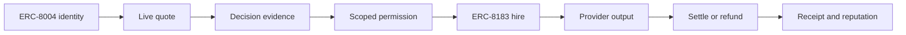

# SafeHire：历届 BNB 获奖作品与本届评委偏好

> 核对日期：2026-08-31。赛事事实以 BNB Chain 官方活动页和官方获奖回顾为准；
> SafeHire 状态以当前仓库代码、公开 API 与 evidence 目录为准。本文不构成官方评分或获奖保证。

## 当前结论

SafeHire 已经具备 Working MVP 的主要技术闭环：四类外部 BSC Agent 发现与报价、
`/hire-live` 的 ERC-8183 主网雇佣流程、Job #808 的完整测试网结算证据、权限控制、
公开 proof dossier、TermiX 原始输出、PancakeSwap 可重算收益证据和 provider intake。

因此，旧版本中的“真实 Agent 只能报价，没有统一雇佣页”已经不再成立。准确状态是：

- **雇佣页已实现**，但外部主网付费交付记录仍为 `0`；
- **盲评实验室已实现**，但独立真人盲评记录仍为 `0`；
- **provider intake 已实现**，但当前四个 live skill 仍来自 `1` 个运营方；
- **提交结构可以通过门禁**，但获奖级采用证据仍需真人和链上动作补齐。

这四个数字比继续增加协议或页面更影响评委信任。

## 本届官方评审重点

官方主赛要求市场让普通用户能在少量点击中找到、理解和激活 Agent，并将四类
Agent 作为同等重要的一等能力：

1. Rebalancing
2. Grid Trading
3. Yield Optimisation
4. Health Factor Monitoring

主赛公开列出的三个评分维度是：

- **Functionality**：完整端到端运行，不能出现发现后无法激活的死路；
- **Data Quality**：实时、准确、足以支持用户选择；
- **Agent Diversity**：四类都要有同等深度，不能只把一类做深。

官方没有公布主赛三项的数字权重，因此本仓库只输出逐项状态，不生成所谓“官方总分”。

伙伴奖方面：

- TermiX 要求至少三个真实任务，分别完成“通过市场雇佣 Agent”和“不用 Agent”
  两条路径，记录时间、成本、质量并附完整输出；
- PancakeSwap 要求给交易者或 LP 带来真实好处；
- Altana 要求自己的 wallet、scoped session、真实 session-key 交易和应用内撤销，
  并附 Explorer 证据。

官方入口：

- [The Smart Money Era](https://www.bnbchain.org/en/hackathons/smart-money-era?tab=tracks)
- [Build the Official BNB Agent Studio Marketplace](https://www.bnbchain.org/en/blog/build-the-era-build-the-official-bnb-agent-studio-marketplace)

## 历届官方获奖项目反复出现的模式

| 官方案例 | 官方突出点 | 对 SafeHire 的直接启示 |
|---|---|---|
| Neural Alpha / Genesis / Gridora | 分析真实市场、执行策略、链上交互、自主运行 | “推荐”必须继续到动作或交付 |
| DeFi Copilot | 实时分析 + 一键执行 + PancakeSwap 管理 | 复杂 DeFi 要压缩成一条清楚路径 |
| DeFi Pro | 用简单交互接入 Pendle、Lista 与实时收益 | 使用门槛和实时数据比堆模型更重要 |
| Midas | 实时信号 → 推理 → 模块化工作流 → 自动交易 | 输入、判断、行动和结果应形成因果链 |
| BIBIM | 创建、测试、变现策略的直观界面 | 能试、能比较、能复核比抽象协议叙事更强 |
| AGOS Clawjob | Agent 服务市场、USDT 支付、链上交易 | 市场必须有真实商业激活，不只是目录 |
| ShieldBot / Aegis | 执行前拦截或监控后采取可验证保护动作 | 风险控制必须影响资金路径，而非装饰面板 |
| Tearline / Tutorial Agent 等 | 官方回顾强调用户、请求、交易量等采用数据 | 真实使用指标会显著提高可信度 |
| MCPForge | 把能力包装为可部署、调用、变现服务 | Provider onboarding 和标准接口决定可扩展性 |

官方回顾：

- [AI Trading Agent Edition winners](https://www.bnbchain.org/en/blog/meet-the-winners-of-bnb-hack-ai-trading-agent-edition)
- [Good Vibes Only winners](https://www.bnbchain.org/en/blog/good-vibes-only-the-ai-hackathon-winners)
- [BNB Hack Abu Dhabi](https://www.bnbchain.org/en/blog/bnb-hack-abu-dhabi-highlights-from-the-hackathon-and-demo-night)
- [BNB Hack Buenos Aires](https://www.bnbchain.org/en/blog/bnb-hack-buenos-aires-recap-highlighting-builders-innovation-and-the-winners)
- [BNB Hack 2024 Q4](https://www.bnbchain.org/en/blog/bnb-hack-2024-q4-winners-a-celebration-of-innovation)

## 从获奖模式推导出的五条评委偏好

### 1. 评委奖励闭环，不奖励组件数量

获奖项目往往能用一句话描述用户从问题到结果的路径。协议、模型、合约和数据源只有在
这条路径中发挥作用才加分。

SafeHire 应固定为：

```text
Discover → Compare proof → Quote → Bound authority → Hire → Delivery
→ Settle/refund → Receipt → Reputation
```

不要演示时按“先介绍三个合约，再介绍七个插件，再介绍四个 Agent”的顺序。

### 2. 真实数据必须能改变决定

仅展示 TVL、APY、health score 或 reputation 不足。评委会问：

- 这个值来自哪里，什么时候采集？
- 它为什么改变推荐？
- 如果来源失败，系统会不会用 fixture 伪装 live？
- 身份分、端点健康和实际交付质量是否被混为一谈？

SafeHire 的优势是已经区分当前 A2A 探测、8004scan 缓存信号、用户输入和链上证据。
下一步不是再加字段，而是用一次真实付费交付证明这些字段真正支持了选择。

### 3. “真实动作”比“可执行按钮”更有说服力

`/hire-live` 证明代码已经能生成和校验交易步骤；Job #808 证明测试网完整流程曾完成。
但最强证据仍是一笔从当前外部卡片发起的真实小额交付。

这也是当前第一优先级。

### 4. 简单界面背后可以有很深技术

历届项目经常把复杂协议压成一个明显动作。SafeHire 应让评委先看到：

- 我雇的是谁；
- 为什么选它；
- 它能花多少；
- 它会交付什么；
- 不满意如何退款/撤销；
- 最后去哪验证。

AgentProof、hash-chain、ERC-8004、ERC-8183 和 policy 是答案的底层，不应成为首页
第一屏的术语墙。

### 5. 真实采用会放大所有技术分

第二运营方、第一笔外部付费任务、独立盲评者和一段真实使用反馈，会同时提升：

- Functionality 的可信度；
- Data Quality 的结果数据；
- Agent Diversity 的市场真实性；
- TermiX 的 Proven Agent Advantage；
- 官方采用为 canonical marketplace 的说服力。

## SafeHire 当前最有竞争力的创新

### Proof-carrying Agent Marketplace

传统 Agent 市场往往把身份、评分、权限、付款和交付分开。SafeHire 把它们组合为一个
可携带、可复核的工作证明包络：



这个创新点比“我们也有 AI Agent”更容易征服评委，因为它解决的是 Agent 金融市场
不可避免的信任问题，并且每一层都能展示真实证据。

### Evidence before authority

用户不是先给 Agent 一个钱包，再希望它做对；而是先看任务级证据，再只开放完成任务
所需的目标、方法、金额和时间。

### Honest decision data

SafeHire 明确区分：

- 注册身份；
- 当前 endpoint 可达性；
- 索引平台的缓存健康/评分；
- SafeHire 自己观察到的交付；
- sponsored 分析；
- paid track record；
- testnet 与 mainnet。

这种“拒绝把弱信号包装成强证明”的能力本身就是金融 Agent 市场的产品价值。

## 当前差距，不再使用过时描述

### 已经补齐

- 从 live card 到 `/hire-live` 的统一路径；
- 外部 ERC-8183 任务、预算、授权、托管、通知、结算和退款交易计划；
- 真人计时和隐藏 A/B 的 benchmark lab；
- 第二 provider 的只读 intake 校验；
- 多档 PancakeSwap 报价和 Gas 后净改善；
- 官方索引信号与 SafeHire 当前探测的分开展示。

### 仍需现实世界完成

1. 第一笔外部主网 `0.10 U` 付费交付；
2. 三项真人无 Agent 计时；
3. 另一位真实评审人的三项盲评；
4. 第二个独立 ERC-8004 运营方；
5. 评审期稳定托管与短视频；
6. 最终提交人的身份、钱包和条款确认。

## 最终判断

SafeHire 的技术和差异化足以进入认真评审范围。它比一般“AI 推荐 + 钱包连接”
项目更强的地方，是把权限和证据做成了产品主线。

最可能阻止它获奖的理由不再是“功能没做”，而是：

> 评委看到了一个很完整的安全市场，但没有看到足够多的外部真实使用，因而不确定它是
> canonical marketplace，还是一个完成度很高的单运营方演示。

因此，剩余时间的最优使用方式不是继续扩功能，而是把现有闭环变成一条不可反驳的
真实采用证据。
