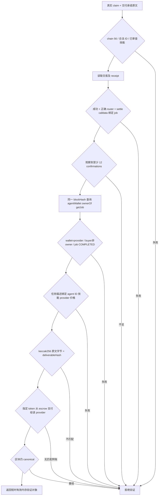

# SafeHire / ProofOps：冲击 BNB 主赛冠军的施工蓝图

版本：2026-09-05。适配提交：`267e4978c56adc2c566ab82fc134b18b0a5a7708`。

## 0. 结论与交付范围

**应争取的优势不是“功能最多”，而是“在四类金融任务中，最容易依据可信证据选择并雇佣 Agent”。** 当前已有协议集成与工程基础，但供应商选择、真实交付、类别能力范围和独立验证尚不足以支持“有夺冠把握”的判断。

此版本交付的是有基线校验的**增量源码修复包**，包含完整修改文件、自动应用脚本、统一 diff、测试、运行手册和竞品研究，不是重新打包旧版 evidence 的完整仓库。没有向 GitHub 推送；没有替用户发主网交易。

本地源码引导来自历史归档，但本次涉及的现有 `apps/src/scripts/tests` 子树，以及 `AGENTS.md`，其 Git 对象哈希已与锁定主分支核对一致。最新证据目录没有被旧快照覆盖。详细来源与 SHA 见发行包根目录 `SOURCE_PROVENANCE.json` 和 `manifest.json`。

## 1. 目标与不可混淆的证据层级

| 层级 | 可以说明什么 | 不能说明什么 |
|---|---|---|
| 注册交易 / ERC-8004 | 某身份存在；特定钱包是 agentWallet | 用户受益、服务质量、独立业务实体 |
| 当前 A2A list | 当前接口宣称提供该服务且可达 | 付费输出质量、执行成功率 |
| 原始报价 | 当前商业条款 | 已付款、已执行、实现利润 |
| 正确任务的结算与 Transfer | 该任务发生受约束的付款交付 | 输出内容正确或真正增值 |
| 同输入配对基准 | 记录的时间/成本、可追溯原始输出 | 第三方独立性和统计意义自动成立 |
| 身份可核验的独立评审 | 在明示规则下的质量意见 | 长期收益、普遍安全或官方分数 |

本次 paid verifier 使用 ERC-8004 的 `getAgentWallet` 与 `ownerOf`，并在结算区块查询任务和身份；EIP-1898 精确区块要求不满足时拒绝降级到 latest。这些规范来源见研究文档 S10–S12。

## 2. 已实现与未完成，一张表区分

| 工作项 | 此包状态 | 入口与验收 |
|---|---|---|
| 证据比较决策页 | 已实现，离线 UI + ASGI 验证 | `/decision`；四类、搜索、同类比较、范围差异提示 |
| 来源时效与可调用性 | 已实现，单测验证 | 保留原始时间；60 秒时效；异常/超时不能换成 demo 或 fresh |
| 供应商口径 | 已实现 | 展示索引钱包数量、未解析数量；不把标签/钱包数叫独立公司数 |
| 四类确定性风险预览 | 已接入已有引擎并修复部分计算 | `/api/decision/preview`；没有下单权限 |
| 付费交付重放 | CLI 与验证核心已实现，合成传输单测验证 | `scripts/verify_paid_delivery.py`；真实节点/钱包尚未验收 |
| 盲测材料 | 已实现离线校验及 A/B 生成 | `scripts/paired_benchmark.py`；不自动认证评审独立性 |
| 自评门禁 | 已收紧 | 旧 `paid:true`/`independent_reviewer:true` 文件不再直接开绿灯 |
| 第二家真实供应商 | 未获得 | 必须完成业务接入与钱包/接口验证，不制造第二套身份充数 |
| 四类实际执行深度 | 未补全 | 当前外部能力偏分析/监控，LP 区间重置尤其存在缺口 |
| 主网真实付费交付 | 未执行 | 需用户手动批准、小额固定预算、真实输出原文 |
| 独立评审身份/冲突审查 | 未自动化 | 需第三方实际评审及人工核对身份和利益关系 |
| 付费结果持久化回灌市场页 | 未实现 | 当前市场页明确 unknown；CLI 输出不得被直接当数据库真相导入 |
| 公开部署与录屏 | 未执行 | 需要在用户环境验收完整应用和原有钱包流程 |

## 3. 整体架构与调用链

```mermaid
flowchart LR
    U[用户] --> D[/decision]
    D --> R[Decision APIRouter]
    R --> C[单进程 single-flight cache]
    C --> L[已有 live_agent_market]
    L --> A[已审查的 A2A list]
    L --> I[8004scan 索引]
    R --> P[证据投影与同类比较]
    P --> G{新鲜且已审查?}
    G -->|否| X[禁用雇佣入口]
    G -->|是| H[已有手动钱包雇佣页面]
    D --> E[四类确定性风险预览]
    H --> W[用户逐笔确认 原有流程]
    W --> J[真实 ERC-8183 任务]
    J -.提供 claim 与精确交付原文.-> V[只读重放 CLI]
    V --> B[同一结算区块: 交易 身份 任务 转账 承诺]
    B --> O[可信 RPC 观测报告 非质量保证]
    O -.待实现身份审核和持久化.-> S[Outcome Store]
    S -.待实现.-> P
```

### 模块边界

`decision/market.py` 只做投影、类别范围和缓存；不接任意网络地址，不签名。`routes.py` 为 FastAPI 新增路由，并把已有四类引擎接入同一无钱包预览。`paid.py` 只对白名单 RPC 方法读取固定网络、固定部署合约，不含任何广播路径。`benchmark.py` 只操作指定目录内的受限文件，不运行外部命令，不读取私钥。

新增页面从现有首页入口进入，分析雇佣沿用原来的 `/hire-live?skill_id=...`。因为原有交易适配器仍为单供应商，未知 token/skill 不被新页导入同一雇佣入口；未来接入第二家供应商必须先完成适配器注册。

## 4. 工作包 A：可信比较与数据时效

### 已落地行为

来源时间、索引最后检查时间、注册快照时间分开。未知时间、没有时区、明显未来时间均不能标 fresh。当前 A2A 探测的新鲜阈值为 60 秒，缓存 20 秒，单次 loader 最长 25 秒；这些是本项目保护参数，不是链共识规则。

并发请求共用一次拉取；刷新失败沿用原始时间并禁用雇佣，不把缓存时间当新观测时间。缓存是每个 ASGI worker 一个；多 worker/多实例应改共享缓存，不能把本实现宣传为全局限流。

前端每 45 秒在可见页面刷新；每秒检查显示中的探测是否过期，过期先停用链接。刷新失败清除旧候选和可点击的旧雇佣按钮。

比较只能是同类 2–3 个不同注册身份。单候选保持“缺少同类选择”，跨类别请求返回 422。排序仅基于可调用、范围匹配、身份信息完整度和稳定 ID，不引入付费推广、收益概率或官方评分。

### 继续施工：第二家供应商适配层（P0）

建议新增：

- `src/proofops/providers/registry.py`：保存 provider_id、chain_id、registry、agent_id、agent_wallet、reviewed_at、expiry、endpoint、capability_scope、supported_rail。
- `src/proofops/providers/base.py`：`list_services/quote/prepare_hire/job_status/notify_delivery` 接口，所有写操作只输出待用户确认交易。
- `brainonbnb.py`：将现有硬编码逐步迁移，保持回归兼容。
- `second_provider.py`：真实接入后再加入，不能只添加示例。

输入 schema 应包含 `provider_id + registry + agent_id + skill_id`，而不是只用 skill_id 路由。报价必须绑定网络、商务合约、付款 token、provider、预算、expiry 和用户输入摘要。新 endpoint 要做 HTTPS、禁止内网/本机地址、重定向限制、响应大小限制和域名所有权检查；不能让访客提交任意 URL 后让后端直接请求。

验收标准：同一类别中两家实际可调用、实际交付的供应商；分别显示原始输出和费用；钱包地址不同只能作线索，独立业务实体需要额外人工确认。

## 5. 工作包 B：四类能力的具体深度

| 类别 | 必须呈现的数据 | 必须展示的任务结果 | 当前最重要缺口 |
|---|---|---|---|
| LP Rebalancing | pool、position、tick 区间、当前价格、流动性、gas/滑点 | 原区间与新区间、为何 hold/rebalance、实际动作回执 | 外部 `rebalance_plan` 是 portfolio 定价，不是 LP 自动重置 |
| Grid | grid level、单笔资金、fee/slippage/gas、最大预算 | 成本覆盖后的网格间距、订单状态、取消/停止 | 目前是分析；配置 drawdown 不代表链上止损已强制 |
| Yield | 旧仓位、新仓位、APR/APY 口径、预期持有期、迁移成本 | 相对继续持有的增量净收益、回本天数、迁移回执 | 当前比较候选收益，不是完整仓位迁移优化器 |
| HF | 协议、账户、抵押/负债、清算阈值、价格和区块 | 压力后 HF、达到目标需偿还金额、告警与保护动作 | 当前单次分析不等于长期监控和真实保护执行 |

### 数学修复与边界

APY 采用有效年化口径：

`horizon_gross = capital * expm1(log1p(apy_percent / 100) * days / 365)`

`net = horizon_gross - transaction_cost`

旧的 `net * (1-risk/125)` 会减轻负收益。当前为：

`utility = net - abs(net) * risk_score / 125`

这保证同净收益下风险增加不会提高 utility，但 **risk_score/125 仍只是既有启发式，不是违约概率/期望损失模型**。全部候选为负时返回 hold，不制造“最优但亏损所以必须迁移”的建议。

Grid 的一档往返简化估算：

`gross_cycle = order_notional * (price_ratio - 1)`

`round_trip_cost = order_notional * (1+price_ratio) * (fee_bps+slippage_bps)/10000 + 2*gas_per_order`

成本缺失时输出 unknown 并拒绝可执行预览；净价差非正也拒绝。它只是一次邻档成交的估算，**不是完整网格回测**，不含所有冲击/库存路径风险。所有引擎结果明确 `execution_authority=none_preview_only`；已有 confidence 被标成未校准策略启发值，不能说成功概率。

P0 后续：为每类补一条真实输入→真实外部服务输出→用户确认→动作/告警回执，统一显示能力范围。不要用演示数据代替实际执行。

## 6. 工作包 C：付费交付的只读重放



仅支持已核对的现有部署 ABI 和直接 router settle 交易。经未知中间合约执行、修改过的 ABI、RPC 不支持历史状态/精确区块、提供的是 URI 而不是准确的承诺原文时，均需要人工调查，不能偷偷跳过校验。

12 个确认是项目保守门槛，不是不可逆终局保证。RPC 可能不可信，此报告不是轻客户端/SPV 证明。即使 hash 对上，也只说明交付原文绑定，不说明内容正确。不同钱包也不能彻底排除同一主体控制。

`VerifiedDelivery` 只从本轮实时校验路径直接传给 scorecard，5 分钟有效；保存的 JSON 不能重新反序列化就当 fresh。原有 paid/review JSON 仅作为待核验文件计数。

### 剩余落地（P0/P1）

先用用户手动批准的真实小额分析任务验证节点、代理合约、付款与承诺格式，再建设 Outcome Store：主键 `(chain_id, commerce, job_id)`，唯一 settlement hash，保存原始收据及 hash、registry 身份、交付指纹、评价维度、核验时间与失效原因。每次公开宣称“已核验”需明确观察时间；重组或复核失败撤回徽标。

当前不把 CLI 的文件自动回灌页面，更不把“保存报告”当成“永久可信”。

## 7. 工作包 D：真实配对测量与盲测

三个任务建议：网格成本可行性、Venus 账户清算距离、LP 范围调整。对每个任务明确同一时点/区块和同一输入；各跑 Agent 与人工基线，保留输出、起止时间、支付和其他成本。

测量 schema 与命令见 RUNBOOK。双方必须绑定同一个 prompt SHA256；原始输出 SHA256 不匹配、重复 task_id、零/负耗时、非有限成本或越界路径都会拒绝。

A/B 标签随机化，揭盲映射加随机盐做 SHA256 commitment；映射存放独立私有目录，权限 0600。公开目录只有中性 case ID、prompt、A/B 输出、评分要求。**正文仍可能暴露作者特征**，评审必须记录是否识别出来源；不能声称绝对双盲。

评分维度：准确性、完整性、来源质量、安全性、可操作性；每项 0–5 并引用输出段落。第三方身份、利益冲突与评审授权需要人工核对，本包不认证其独立性。少量样本只呈现原始结果和局限，不输出统计显著性或长期成功率。

成本要说明 gas、服务费、模型费、人工时间哪些包括/不包括。U 不自动等同 USD；换算依据放在 cost_basis。不要给人工流程填 0 秒后计算“无限倍提速”。

## 8. 工作包 E：提交前部署与评委演示

工程验收目标（不是已达到的指标）：公开页面无需登录即可看分类/证据/模拟；冷启动不阻断评委；数据故障有解释且无伪实时；钱包交易逐步要求手动确认；退出/失败可以回到可理解状态。

建议演示主线：

1. 同类候选的“证据够不够”，解释四个 skills 不等于四家供应商。
2. 用高成本场景让 Grid 正确拒绝；切低成本给出透明估算，不说稳赚。
3. 打开真实分析雇佣路径，显示固定预算和明确的服务范围。
4. 展示已经真实完成的任务与重放报告，故意修改交付文件后验证失败。
5. 展示三个真实任务的配对基准与第三方评论，而非自己给自己打分。

所有录屏中的“真实”步骤都必须先真实完成。未完成时保持未完成说明，不能拼接不同任务交易作为同一闭环。

## 9. 冻结前施工顺序与放弃项

优先 A：应用此包，安装项目依赖并跑全套测试，验证 `/decision` 与原 `/hire-live` 的完整连接。

优先 B：接触第二家供应商，明确 LP 能力；真实业务接入比新增十个菜单更关键。

优先 C：完成有固定小额上限的真实付费任务，验证返回的 commitment 格式，再跑只读重放。

优先 D：三项真实配对任务，外部评审，稳定公开部署与短录屏。官方 9 月 9 日 UTC 的截止时分仍需确认，避免按旧文档晚一天。

冻结前不做：新增治理币/多链、把 8004scan 全量索引数当可用服务数、未经审计的自动主网执行、为赚副赛叠加未经验证的 session SDK、用 AI 自动评分冒充独立评审。

**冠军是相对竞争结果。此蓝图提升的是可验证的产品质量与规则匹配度，不是能兑现的获奖承诺。**
