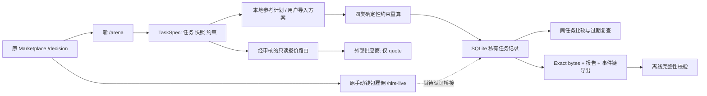
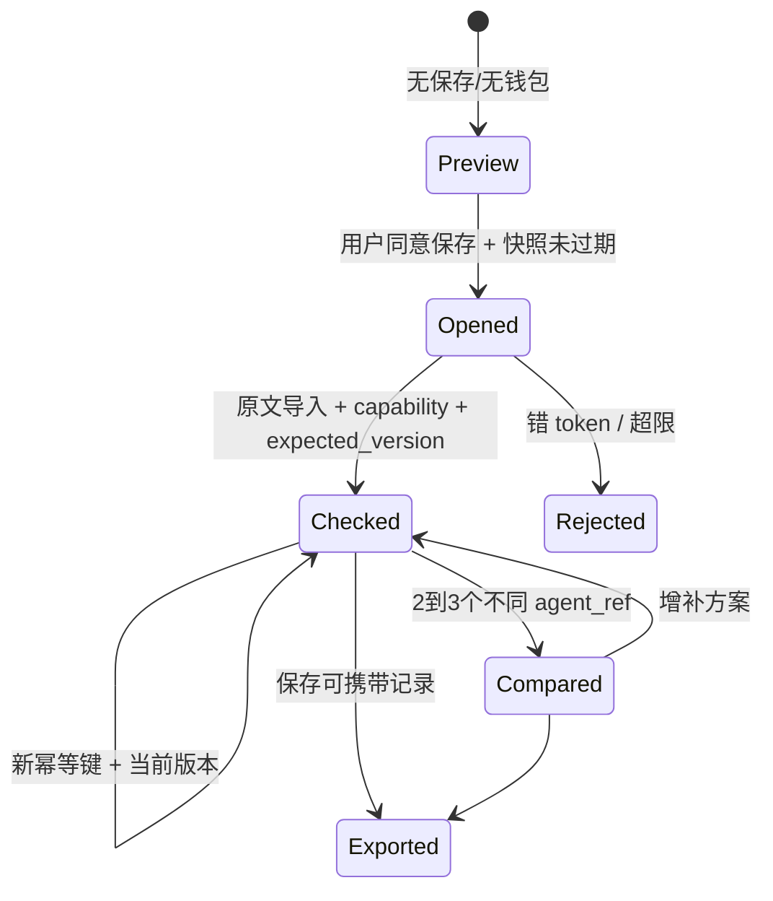

# 冠军冲刺 V2：具体施工蓝图

## 1. 架构与明确的非目标

新增代码不进入签名/审批/交易广播路径。市场发现和手动支付保持原行为；Arena 新增“任务绑定＋语义验收＋可导出记录”。本轮不修改 `contracts/`、`agent-studio/`、已有 `evidence/` 或 `.env`。



虚线还没有实现，不是一个隐藏的自动回调。已有 paid verifier 的链上结果不能直接作为 Arena 的付款凭证；必须再绑定同一 task_hash、job、供应商及交付承诺。

## 2. 文件级施工结果

| 文件 | 责任 | 已有验收 |
|---|---|---|
| `arena/models.py` | 严格数据模型；四类输入；时区/TTL；域分离任务与快照 hash | 非法数字、额外字段、过期、错任务测试 |
| `arena/planners.py` | LP、Grid、Yield、Health 参考计划和验收重算 | 成本、容量、债务冲击、错误参数反例 |
| `arena/providers.py` | 逐身份/技能/分类路由；Brain legacy 与 SafeHire v2 quote adapter | 不允许任意 URL、错链/错任务、限时/限量/熔断 |
| `arena/store.py` | 私有任务、原文、幂等、版本、原子事务、事件链、导出 | 重启后读取、并发冲突、修改检测、跨任务拒绝 |
| `arena/routes.py` | REST 路由、开关、Bearer capability、body/nesting 边界 | 401/404/409/413/422/429/503 路径；实际 API 测试 |
| `arena/examples.py` | 四类合成输入与正反例，严格与真实商户隔离 | 一通过一拦截；真实供应商计数为0 |
| `apps/web/arena.html` + assets | 四类引导、原文导入、同任务比较、导出、报价显式同意 | 桌面/手机真实 JS + 隔离 ASGI 测试 |
| `apps/api/main.py` | 追加 Arena 路由、中间件与静态页 | 语法检查；完整应用 lifespan 仍待完整依赖环境 |
| `config/arena-providers.json` | 已知四条 Brain 技能路由，默认全部禁用报价 | 离线 schema 检查；不证明存活/独立性 |
| `scripts/arena_*` | 本地隔离服务器、浏览器测试、配置/导出校验 | 见 TEST_REPORT |

## 3. 任务、方案与状态

`TaskSpec = category + snapshot(chain_id, block_number, block_hash, observed_at, source) + limits + inputs`。

`task_hash = SHA256(canonical({domain: safehire-acceptance-task-v2, task: normalized_task}))`。

canonical 是本项目 Python JSON 序列化约定：字段排序、UTF-8、无多余空格、拒绝非有限数；**不是 RFC8785/JCS 或 EIP-712 跨语言签名标准**。需要 SDK 互通时以服务器返回 hash 为准，不能让 JS 自行浮点重序列化后猜测同一 hash。

`Proposal` 引用任务与快照，带 agent_ref/action/parameters。agent_ref 只是输入声明；`local:*` 明确是本地参考或测试方案，`56:token:skill` 也必须后续验证签名才能归因。



幂等键作用域是 task_id，绑定精确 UTF-8 原文；相同键＋不同字节返回409。重复相同原文返回首次记录，不重复生成事件。版本号 optimistic concurrency 避免两个请求覆盖结果。失败方案同样记录，不能只留下通过结果。存储最多2000任务、每任务10方案；公开上线前仍需网关用户配额/速率限制。

## 4. 四类验收数学与边界

### 4.1 LP 区间管理

以 v3 原始 token1/token0 比价的 tick 为口径，`sqrtP = 1.0001^(tick/2)`。目标上下 tick 按 spacing 对齐并截到协议边界；检查当前 tick 在目标范围、原仓位已移出才重置、成本/滑点不超限。

固定流动性 L 的理论库存，先将 p 限制在 [a,b]：

```text
amount0_raw = L * (b-p)/(p*b)
amount1_raw = L * (p-a)
amount0 = amount0_raw / 10^decimals0
amount1 = amount1_raw / 10^decimals1
```

显示原区间与目标区间的理论库存差额。**没有证明资金充足，没有读取 NFT 权属或池地址，没有构造真实 mint/swap；不是 Solidity 逐位相同的整数报价。** 成本或滑点限制导致无法重置时保留 hold，但报告“range_target_resolved=false”，不说保护已完成。

### 4.2 网格

仅对一个完整成交的相邻买卖周期建模，不是回测，不是策略累计 PnL。`A=capital/levels`，`r=(upper/lower)^(1/(levels-1))`，每边费用比例 `c=(fee+transfer_tax+slippage)/10000`：

```text
net_cycle = A * r * (1-c)/(1+c) - A - 2*gas_per_order
break_even_ratio = (1+c)/(1-c) * (1+2*gas_per_order/A)
```

验证价格梯度、订单数量、止损价、正净价差与成本预算。把买入费用也从预算中扣除，避免只扣卖出一侧。没有假设全部网格能循环成交；库存风险、跳空、MEV 和真实流动性仍不包含。

### 4.3 收益路由

输入字段 `apy_pct` 是有效年化复利百分数，不是 APR。若上游给 APR，适配器应根据真实复利频次转化；不知道不能默认当 APY。

```text
hold_income = C * ((1+current_APY)^(days/365)-1)
route_income = C * ((1+candidate_APY)^(days/365)-1) - migration_cost
increment = route_income - hold_income
```

只有增量超过用户门槛、容量够、退出等待不超过持有期、成本达标才 route。否则 hold；不把“不操作”当零收益。收益率仍是假设输入，不保证兑现。

### 4.4 借贷保护

按资产求和，抵押物阈值乘下跌冲击、债务乘价格上涨冲击：

```text
C_stress = Σ(collateral_value * liquidation_threshold * (1-drop))
D_stress = Σ(debt_value * (1+rise))
HF_stress = C_stress / D_stress
repay_required = max(0, D_stress - C_stress/target_HF)
```

偿债需求按美分向上取整并不超过全部债务；缺预算就明确未解决。零债务使用 null 加 `no_debt/debt_cleared`，不用 JSON Infinity。这里还假设可从外部资金用美元等价额偿还债务，不代表已取得债务资产或考虑换币滑点；真实协议的清算阈值、隔离池和价格源需由后续适配器认证。

## 5. REST 接口与错误行为

| 接口 | 输入 | 行为 |
|---|---|---|
| GET `/api/arena/capabilities` | 无 | 查看开关、已配置路由；不宣称 live |
| GET `/api/arena/examples` | 无 | 带合成标识的示例 |
| GET `/api/arena/synthetic-walkthrough/{category}` | 四类之一 | 两个本地测试计划，一正一反，不记入供应商业绩 |
| POST `/api/arena/preview` | TaskSpec | 本地参考计划与验收，不保存 |
| POST `/api/arena/tasks` | TaskSpec | 保存冻结任务；返回一次性 task_token |
| GET `/api/arena/tasks/{id}` | Bearer capability | 私有导出，不返回 token |
| POST `/api/arena/tasks/{id}/proposals` | 原文字符串、expected_version、Idempotency-Key | 保存 exact bytes 与重算报告 |
| POST `/api/arena/tasks/{id}/compare` | 2–3个 proposal_id | 重新校验当前 TTL；不是重用旧通过徽标 |
| POST `/api/arena/tasks/{id}/quote` | agent_ref、严格布尔 consent_send_task | 全局＋路由均启用才访问已审核端点；只询价 |

所有 Arena 响应 `Cache-Control:no-store`。缺 token 返回401，错 token/不存在任务统一404；版本/幂等冲突409；超过64000字节或 JSON64层返回413；输入问题422；容量429；未启用503；外部 HTTP 超时/错误502，不转成 demo 成功。上游 JSON response 最大64000字节，重定向不跟随，单次HTTP timeout10秒、整体20秒、并发最多4，失败三次断路30秒；熔断状态目前每个进程独立。

## 6. 具体下一批施工任务（不得把 TODO 说成已上线）

| ID | 任务与拟改文件 | 前置条件 | 必须验收 |
|---|---|---|---|
| P0-A | `arena/identity.py`：按固定块读取 ERC-8004 归属/钱包与技能声明 | 可用 BSC RPC、注册服务信息 | token换主、块重组、错链、RPC超时均不能继续“已验证” |
| P0-B | `arena/delivery_adapter.py`：保留供应商 raw bytes + normalize 独立版本 | 第二供应商输出协议明确 | 原文不改；映射后的每个金额/资产可回溯；缺字段不能编造 |
| P0-C | `arena/paid_binding.py`：连接旧 paid verifier 与 task_hash | 用户批准的小额真实付款、相同job交付原文 | job/链/商户/金额/块/原文/task 全匹配；不接受上传 booleans |
| P0-D | `arena/reviewer.py`：签名身份、盲测分配、利益关系 | 独立评审愿意参与 | 相同人多身份、买卖方自评、重放、改分留下证据；支付证据不当质量证据 |
| P0-E | `arena/outcomes.py`：认证后事件回灌到 `/decision` | A/B/C完成 | 明确分母/样本窗口/失败数；旧快照不当现值；本地方案绝不进真实业绩 |
| P1-A | 非 JSON 的真实任务表单＋成本预估＋真实源刷新 | 对应类别数据源可用 | 浏览器无开发者指导也能完成；变更数据必须使旧报价失效 |
| P1-B | 托管环境验收与原入口全回归 | eth-account/eth-abi/web3/TS依赖完整 | 原雇佣/撤销/退款不回退；移动端和外部机器可复现 |

原则：先做一条真实路径，再按相同数据契约扩到四类；不为了“全自动”跳过用户原钱包确认。
