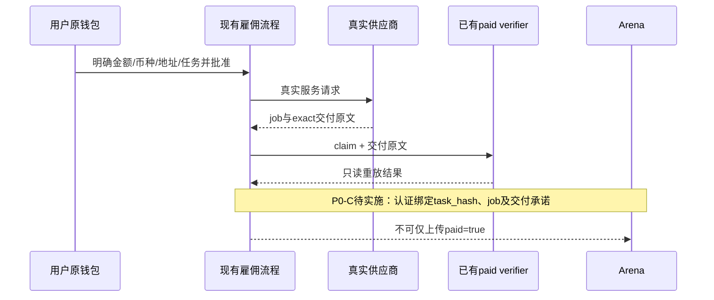

# 供应商接入与真实证据施工手册

## 1. V2 的“多供应商”究竟完成到哪

完成的是 **可配置、多身份、多技能的路由能力**，不是已接入第二家真实供应商。默认清单只有四条已知 Brain 技能，仍属于一个声明运营主体。每条 `quote_enabled=false`。没有注册新代理、签署商户合作或请求收费服务。

两种协议必须分清：

- `brain-a2a-v1`：使用原有 Brain `message/send → negotiate` 格式，仅发送任务用途、hash和服务范围。它不传递完整结构化任务，不保证供应商原生支持 Arena 语义；旧响应未回显 task绑定，因此只显示 informational，不当成已验收交付。
- `safehire-quote-v2`：**本项目定义的报价接口**，不是 A2A 或 ERC 的官方标准。服务端显式回显 task_hash 和 agent_ref，原始价格必须为 uint256 范围整数。即使回应匹配，有有效期，也只是 unsigned_task_bound_quote，不是签名授权。

向第二家供应商发出联系前先核验其 BSC identity/技能/运营主体；征得愿意支持接口的确认。不能把示例域名或者本地参考计划写进 live catalog。

## 2. 配置准入步骤

在 `config/arena-providers.json` 增加真实路由：provider_id、operator_label、chain_id=56、已审 registry、token_id、skill_id、category、HTTPS endpoint、protocol、reviewed_scope。先保持 quote_enabled=false。

```bash
python scripts/arena_check_providers.py config/arena-providers.json
python -m pytest tests/arena/test_providers.py -ra
```

此命令只验证配置语法，不检查链上身份、独立公司或是否能交付。地址/技能匹配审核记录应该包含：链和固定块、registry、owner/agentWallet、agentCard抓取原文、技能范围、运营方声明与利益关系、调用费用/付款币种/退款和隐私约定。当前 V2 未提供审批工作流 UI。

新适配器必须先用 MockTransport 测试，验证正确响应、错链/错技能/错任务/过期、重定向、超大响应和不可用；不得用真实收费请求跑单元测试。报价不能悄悄调用 buy/fund/execute 类方法。服务端部署人员审核后才能启用该路由，再启用全局开关；浏览器用户还必须明确同意发送任务。

## 3. 自定义 v2 报价格式

请求由网关构造，不能让前端指定 endpoint：

```json
{
  "schema_version": "safehire-quote-request/2",
  "task_hash": "服务器返回的64位任务hash",
  "agent_ref": "56:真实token_id:真实skill_id",
  "task": {"这里": "是完整规范化TaskSpec，包含用户输入"},
  "requested_action": "quote_only"
}
```

响应需含 accepted=true、chain_id=56、原样 task_hash、原样 agent_ref、整数原始单位 price_raw、可选 EVM payment_token、带时区的 expires_at。缺有效期则仅供参考；不存在把“当前时间＋五分钟”强行填进去的逻辑。不同付款币种/decimal 未核验时不能比较 USD价格；报价层不把原始金额转成错误的美元成本。

当前只有报价协议；完整交付必须另写 normalize adapter。原始文本不能为了让验收通过而修改；转换后的 Proposal 与供应商原文各有哈希，记录映射代码版本。用户导入的 `agent_ref` 不产生 verified identity。

## 4. SSRF 和故障边界

限制配置端点为HTTPS公共域名，拒绝字面IP、本地域、凭据、query、fragment和非443端口；请求前解析DNS，拒绝任何非global地址；不跟随重定向、不读取代理环境。

**DNS检查和最终连接之间未做IP钉扎，仍有DNS rebinding窗口。** 上线必须在运行环境配置出站白名单，限制私网/回环/元数据地址；不能只依赖一次DNS检查。网关同时需连接/请求速率限制。参考 OWASP SSRF 防护建议：https://cheatsheetseries.owasp.org/cheatsheets/Server_Side_Request_Forgery_Prevention_Cheat_Sheet.html 。

## 5. 从现有真实付款到验收记录的缺失桥梁



既有 `scripts/verify_paid_delivery.py` 保持原实现。本轮没有运行真实链上重放，也没有替你付款。验收通了也只是现有claim覆盖的付款与原文承诺，不等于文章/交易建议质量正确。

## 6. 真正可计入业绩的数据

一条“真实完成”至少应明确：付款网络/交易/job、注册身份和技能、实际报价币种原始单位、原始任务与原始交付、可核验时间、验收代码版本和结果、撤销/失败/退款状态。需要计算成功率时先定义分母及观察窗口，所有失败必须进入分母，样本极小时不宣传稳定胜率。

独立评审还需身份验证与利益关系披露。盲测包生成器只能帮助分发材料；`independent=true` 字段、两个邮箱、两个钱包都不是独立性证明。
